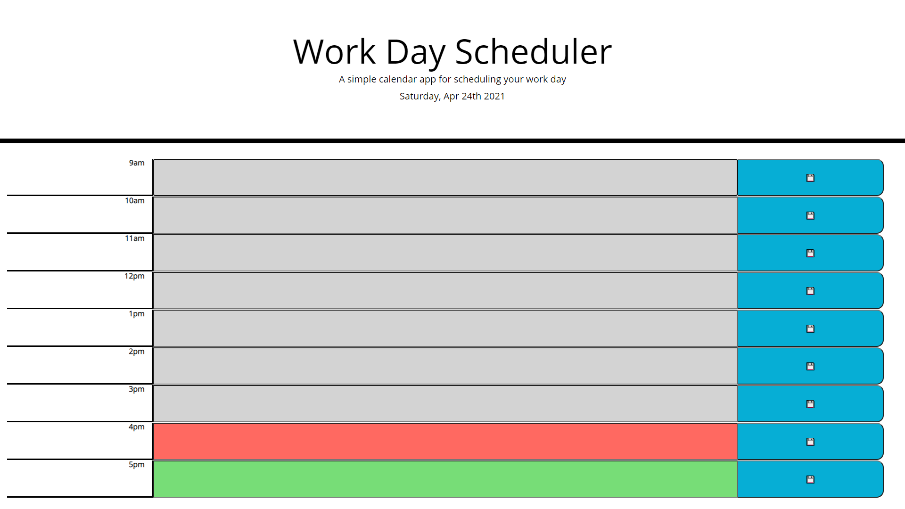
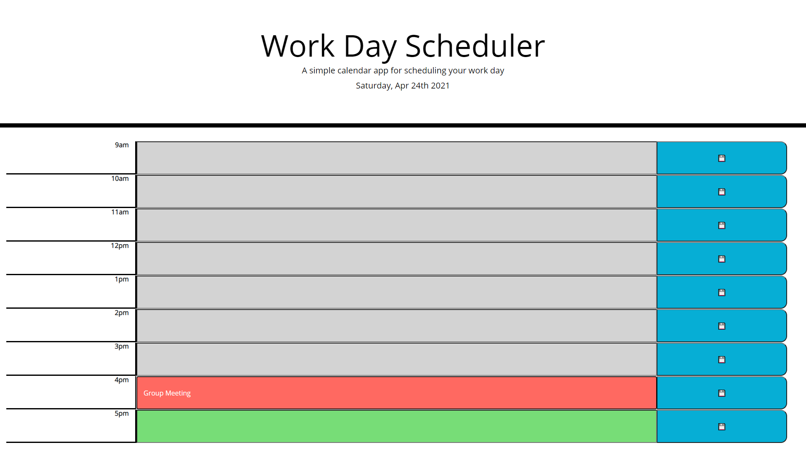
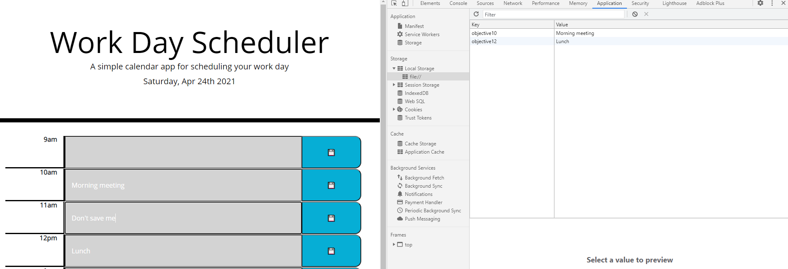
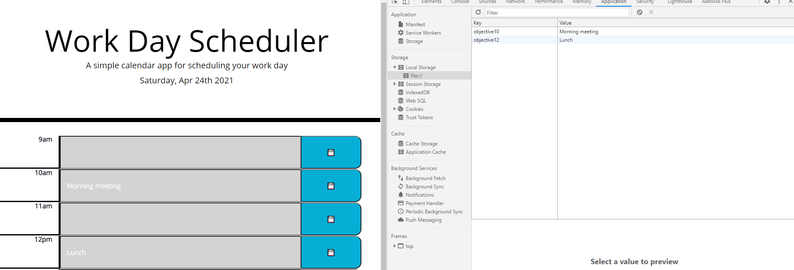

# Workday-Scheduler

## Description

The purpose of this exercise was to modify and add to a starter code in order to generate a dynamically updapting workday scheduler. The objective was to provide the user with some forms to input activities or objectives, saved those objectives to local storage and have them persist upon refresh. There was also a dynamically updated color coded background used to easily indicate to the user the past present and future.

## Tools used

- HTML, CSS, JS as well as web api's such as google fonts, bootstrap, jquery and moment.js. Google fonts to edit the fonts to customize, boostrap for a pre-built CSS library (overlaid with custom CSS), Jquery for javascript handling and reduced codesize and moment for functions and variables that reference time.

## Examples

### Empty Forms

### Input Objective

### Save to Local Storage

### Persist Through Refresh

## Final Thoughts

This was a great exercise in utilizing basic third party web-apis. at the beginning I was having difficulties with some of the dynamic components for this and was instead utilize specific targetting which really bloated the code. Figuring out how to loop through and target specific attributes really allowed this to be streamlined and efficient. using the .forEach and $(this) methods and tools were a lifesaver.